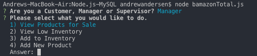

# Node.js-MySQL

This is node based application that uses the terminal to manipulate data from MySQL. Under the guise of a storefront, users will be prompted with various prompts and based on the responses, the MySQL database will be displayed in the terminal and/or manipulated.

To initiate the application, the user will open the terminal from the file in which the application is stored. In the terminal, the user will then type node bamazonTotal.js; screenshot below.

Once initiated, the user will be asked whether they are a customer, manager or supervisor. Each selection will provide different prompts going forward.

**Customer**

If 'Customer' is selected, the terminal will display a table showing all the items in the products table from MySQL aka the store. Below this table the user will be prompted to selected the ID of the item they would like to purchase.

Once the item ID is entered, the user will be asked how many units of the selected item the would like to purchase. If there are enough items in stock, the 'Purchase Successful' along with the total spent (calculated by muliplying the input quanity by the unit price). If the input quantity exeeds the stock, 'Insufficient Quantity' will display in the terminal.

**Manager**

If 'Manager' is selected, the terminal will display 4 options: 'View Products for Sale', 'View Low Inventory', 'Add to Inventory' and 'Add New Product'.

*View Products for Sale*

If 'View Products for Sale' is selected, the terminal will display a table showing all the items in the products table from MySQL aka the store.

*View Low Inventory*

If 'View Low Inventory' is selected, the terminal will display only those products that have a stock quantity of five or less. 

*Add to Inventory*

If 'Add to Inventory' is selected, the user will be provided with a lists of all the products and prompted to select which one they'd like to increase the invetory of.

Once an item is selected, the user will be prompted to enter how many items will be added to stock quantity.

*Add New Product*

If 'Add New Product' is selected, the user will be prompted to the name of the new product they would like to add, they will then be asked to which department said item belongs by selecting from a list of available departments, they will be asked for the sales price and finally how many of the new products will be stocked.

**Supervisor**

If 'Supervisor' is selected, the terminal will provide the user with two choices, 'View Product Sales by Department' and 'Create New Department'.

*View Product Sales by Department*

If 'View Product Sales by Department' is selected a table will be display the name of each department, the total overhead for the department, the total sales for the department, then the amount of profit for the department.

*Create New Department*

If 'Create New Department' is selected the user will be prompted to enter the name of the new department and then to enter the departments overhead.

This project is a great introduction into MySQL and used nodeJS and uses vanilla javascript along with inquirer, mysql and console.table NPMs.

This project is currently maintained and updated by Andrew Andersen (andersac88@gmail.com) if you have any questions, feel free to contact me directly.

Link to my Portfolio:
https://andersac88.github.io/

